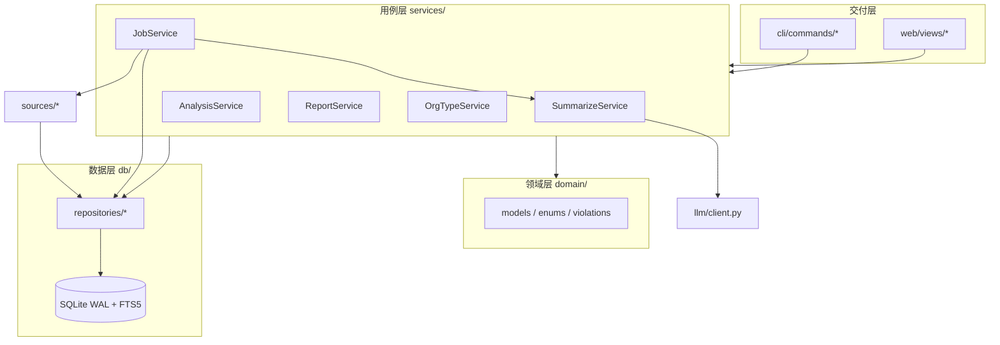

## 需求概述

对 `regwatch`（基金监管案例采集、结构化摘要与统计看板）做一次**全仓范围**的最佳实践重构。数据本体是 JSON 文件，用户明确接受破坏性重构。

## 已确认的方向决策

1. 数据层迁移到 SQLite（单库存储案例/摘要/任务/索引，保留 JSON 导入导出双向能力）。
2. 范围覆盖全仓：核心包 + 采集层 + Web/CLI + 测试补齐 + CI + 文档 + 清理 `reports/` 遗留脚本。
3. 删除 Textual 终端界面（`tui.py`、textual 依赖、相关测试与文档），只保留 Streamlit 网页端 + CLI。
4. 测试由 unittest 迁移到 pytest，补齐 report/org_type/jobs/cli 等缺失覆盖，接入 CI。

## 核心功能（重构目标，能力不回退）

- **数据层**：SQLite 单库 + WAL 替代散落的 JSON 与 `_index.json`/`_summary_index.json`；案例、正文、摘要、违规类型、任务、任务日志、机构类型缓存、抓取断点状态全部入库；提供 `db import/export` 双向迁移与一次性导入对账脚本。
- **分层架构**：领域模型 / 数据仓储 / 业务用例 / 交付层（CLI + Web）四层，依赖注入取代全局单例；筛选逻辑收敛为单一实现供 CLI 与 Web 共用。
- **采集层**：抽出共享 HTTP 客户端（重试/限速/超时）与文档解析子包（PDF/OLE/OOXML/HTML）；2099 行的 `csrc.py` 按「发现 / 抓取 / 解析 / 落盘」拆分；落盘统一走仓储，禁止裸文件写入。
- **任务编排**：任务状态与日志持久化，JobManager 只负责线程与取消，参数定义收敛为单一真源。
- **工程化**：ruff + mypy + pytest + pre-commit + GitHub Actions，补 `py.typed`、LICENSE、动态版本号，对齐 `pyproject.toml` 与 `requirements.txt`。
- **文档**：按新结构重写 README 与 AGENTS.md，删除失效的 TUI 文档与已不存在的目录引用。

## 验收底线

`pytest` 全绿、`ruff check` 与 `mypy` 通过；网页五页（总览 / 案例浏览 / 统计分析 / 任务中心 / 模型与配置）与 CLI 全部子命令（fetch / summarize / report / org-type / config / db）行为不回退。

## 技术选型

**沿用现有栈**：Python 3.11+（uv 管理）、typer（CLI）、streamlit + plotly（Web）、openai SDK（LLM）、requests + beautifulsoup4（采集）、aiohttp（月度公告并发下载）、pypdf / olefile / python-docx（文档解析）、rich（CLI 输出）、pandas（Web 表格）。

**关键选择**：

| 决策 | 选择 | 理由 |
| --- | --- | --- |
| 数据访问 | stdlib `sqlite3` + 手写 SQL + 仓储模式 | 数据规模（千级案例、百 MB 级正文）远未到需要 ORM 的程度；统计以聚合查询为主，手写 SQL 可读性与可控性更好，且不引入 SQLAlchemy/Alembic 依赖与迁移复杂度 |
| 全文检索 | SQLite FTS5 虚拟表 | stdlib 自带，替代 Web 端对 `raw_text` 的内存过滤，关键词检索从 O(N) 降为索引查询 |
| 数据建模 | stdlib `dataclass` | 不引入 pydantic，避免依赖膨胀；配置与 LLM 输出校验用手写 `coerce` 层 |
| 并发写 | WAL + `busy_timeout` + 统一写事务上下文 | 解决当前「整文件覆写索引 + RLock」的并发覆写与跨模块竞态 |
| 测试 | pytest + `tmp_path` 内存/临时库 fixture | 替代 unittest，fixture 复用度高 |
| 移除 | textual / `tui.py` | 用户决策，减少维护面 |


## 实施思路

按「领域层 → 数据层 → 用例层 → 采集层 / 交付层 → 测试 → 工程化」自底向上推进，每阶段可独立提交且测试通过，避免一次性大爆炸。

1. **领域层先行**：把 `datamodels.py` 拆为 `domain/enums.py`（`Dataset` / `CaseStatus` / `CaseType` / `JobKind` / `JobStatus` 等枚举，状态字符串字面量全仓收敛）与 `domain/models.py`（纯数据 dataclass，无 IO）。违规分类体系常量从 `prompts.py` 拆到 `domain/violations.py`，**语义保持不变**（改动会影响历史报告可比性）。
2. **数据层替换**：`db/` 子包承载 schema、迁移器、连接工厂与仓储。核心表：`cases`（AMAC/CSRC 统一表，用 `dataset` 区分，差异字段允许 NULL）、`case_bodies`（`raw_text` 单独分表，列表查询不触碰大字段）、`summaries`、`case_violations`（多值违规类型拆关联表，统计直接 GROUP BY）、`tasks`、`task_logs`、`org_type_cache`、`fetch_state`。迁移器基于 `PRAGMA user_version` 顺序执行。
3. **用例层解耦**：`services/` 下每个服务通过构造参数接收仓储与 LLM 客户端；`container.py` 作为唯一组合根，全局 `get_*` 单例降级为入口层薄适配。删除 `report.py`、`jobs.py` 中的防御性函数内 import。
4. **采集层拆分**：`sources/http.py` 提供可注入的 `HttpClient`（Session + Retry + 令牌桶 + 统一超时/UA），`sources/common.py` 收敛四份重复工具函数，`sources/docparse/` 承接 PDF/OLE/OOXML 解析，`sources/csrc/` 子包拆分 2099 行文件。落盘一律 `CaseRepository.upsert()`，进度一律走 `Progress` 回调协议（删除 `csrc.py` 直写 `sys.stdout` 的全局宽度状态）。
5. **交付层**：CLI 拆为 `cli/commands/*`；Web 视图只做呈现，`filter_case_dicts` 等重复实现删除，统一走服务层；任务参数由 `JobSpec` dataclass 作为单一真源，Web 表单与 CLI 参数均由此生成。

## 架构



## 执行要点（防回归）

- **迁移可回滚**：`scripts/migrate_to_sqlite.py` 只读取 `data/` 原目录、只写新库，导入后自动对账（案例数 / 摘要数 / 状态分布逐项比对原 JSON），确认无误后 `config.json` 才切换到新库；原目录在验证期内保持只读不删。
- **配置兼容**：`settings.py` 读到旧 `data_roots` 六键时自动转换为 `database` 单键、备份原 `config.json` 并提示；环境变量 `REGWATCH_*` 覆盖优先级不变。
- **已知缺陷必须修**：`TaskRecord` 未继承 `_Record` 却调 `super().from_dict()` 的必崩 bug；`build_catalog` 缓存键忽略 config；`llm.py` 用 `abs(hash(api_key))` 做缓存键（受 `PYTHONHASHSEED` 随机化影响）；`_invoke` 降级 `while True` 无硬上限；`write_json` 无 `finally` 清理临时文件；`jobs._execute` 写共享对象不持锁；`org_type.interactive_fill` 用 `print` 而非 logger。
- **性能**：列表与统计全部走 SQL 聚合，替换 `build_catalog` 的全目录 `stat` 扫描；Streamlit 缓存键由目录 mtime 签名改为轻量 `db_revision` 查询；导入批次 1000 条/事务提交。
- **Windows/中文**：所有文件读写显式 `encoding="utf-8"`；SQLite 连接统一 `text_factory=str`；保留 ruff 对 `E501` 与全角标点的忽略规则。
- **清理**：`reports/` 整体退出版本库（`.gitignore` 屏蔽并对已跟踪文件 `git rm --cached`），随之消除未声明依赖 `openpyxl`；删除 `tui.py`、`tests/test_tui.py`、`docs/compose/spec/tui.md`、`scripts/migrate_layout.py`、`logutil.timestamp()` 与零调用的 `TaskLogRouter.clear()`、`AmacCase`/`CsrcCase`/`CaseIndex` 别名等死代码。

## 目录结构

```
src/regwatch/
├── __init__.py                  # [MODIFY] 公共 API 导出 + 动态版本号
├── py.typed                     # [NEW] PEP 561 类型标记
├── domain/
│   ├── __init__.py              # [NEW]
│   ├── enums.py                 # [NEW] Dataset / CaseStatus / CaseType / EntityKind / JobKind / JobStatus
│   ├── models.py                # [NEW] CaseRecord / SummaryRecord / TaskRecord / ModelProfile（替代 datamodels.py）
│   └── violations.py            # [NEW] 违规分类体系常量（自 prompts.py 拆出，语义不变）
├── settings.py                  # [NEW] 替代 config.py：类型化配置 + 旧键自动迁移 + env 覆盖
├── logging_setup.py             # [MODIFY] 替代 logutil.py：统一 logging 配置与任务日志 sink
├── db/
│   ├── __init__.py              # [NEW]
│   ├── schema.sql               # [NEW] 全量 DDL：表 / 索引 / 触发器 / FTS5 虚表
│   ├── migrations.py            # [NEW] 基于 user_version 的顺序迁移器
│   ├── connection.py            # [NEW] 连接工厂：WAL / busy_timeout / 外键 / row_factory / 事务上下文
│   ├── jsonio.py                # [NEW] 旧磁盘 JSON ↔ 记录双向转换（缺字段容错）
│   └── repositories/
│       ├── __init__.py          # [NEW]
│       ├── cases.py             # [NEW] 案例与正文仓储：upsert / get / search / 状态流转
│       ├── summaries.py         # [NEW] 摘要仓储（含违规类型关联表写入）
│       ├── tasks.py             # [NEW] 任务与任务日志仓储
│       └── meta.py              # [NEW] 机构类型缓存 / 抓取断点 / db_revision
├── services/
│   ├── __init__.py              # [NEW]
│   ├── container.py             # [NEW] 组合根：config → database → repositories → services → llm
│   ├── summarize.py             # [MODIFY] 摘要提取用例，依赖注入取代全局单例
│   ├── analyze.py               # [MODIFY] 统计改为 SQL 聚合，保留 AnalysisResult 输出契约
│   ├── reporting.py             # [MODIFY] 由 report.py 迁移，删除防御性内部 import
│   ├── org_type.py              # [MODIFY] 注入 HttpClient，改 logger，去除硬编码 sleep
│   └── jobs.py                  # [MODIFY] 线程/取消归 JobManager，状态与日志落库，返回不可变快照
├── llm/
│   ├── __init__.py              # [NEW]
│   ├── client.py                # [MODIFY] 由 llm.py 迁移：协议 + OpenAI 实现，缓存键改为稳定摘要
│   └── parsing.py               # [NEW] JSON 提取 / 字段 coercing / 降级重试上限
├── sources/
│   ├── http.py                  # [NEW] HttpClient：Session + Retry + 令牌桶限速 + 统一超时与 UA
│   ├── common.py                # [NEW] sanitize_filename / extract_id_from_url / parse_date_from_text
│   ├── progress.py              # [NEW] Progress 回调协议，统一替代 sys.stdout 进度输出
│   ├── docparse/
│   │   ├── pdf.py               # [NEW] 自 csrc.py:949 迁移
│   │   ├── ole.py               # [NEW] 自 csrc.py:748-835 迁移
│   │   ├── ooxml.py             # [NEW] 自 csrc.py:838-895 迁移
│   │   └── html.py              # [MODIFY] 由 _html.py 升级
│   ├── bureaus.py               # [MODIFY] 由 csrc_bureaus.py 迁移，37 局配置外置
│   ├── bureaus.json             # [NEW] 数据驱动的局配置（channelid / 域名 / URL 模板）
│   ├── amac.py                  # [MODIFY] 仅保留发现 / 解析 / 落盘三段
│   ├── amac_monthly.py          # [MODIFY]
│   └── csrc/
│       ├── __init__.py          # [NEW]
│       ├── discovery.py         # [NEW] 列表页 / 搜索 API / 链接收集
│       ├── fetcher.py           # [NEW] process_case 拆为 fetch → parse → persist
│       └── models.py            # [NEW] 采集期中间结构
├── cli/
│   ├── __init__.py              # [NEW]
│   ├── main.py                  # [MODIFY] 由 cli.py 迁移，删除 tui 子命令
│   └── commands/
│       ├── fetch.py             # [NEW]
│       ├── summarize_cmd.py     # [NEW]
│       ├── report_cmd.py        # [NEW]
│       ├── orgtype_cmd.py       # [NEW]
│       ├── config_cmd.py        # [NEW]
│       └── db_cmd.py            # [NEW] db init / import / export / migrate / stats
└── web/
    ├── app.py                   # [MODIFY] 入口与导航
    ├── state.py                 # [NEW] session_state 集中管理
    └── views/ + components/     # [MODIFY] 业务逻辑下沉到 services，缓存键改用 db_revision

根目录：
├── pyproject.toml               # [MODIFY] 移除 textual、新增 pytest、动态版本、sdist、pytest 配置
├── requirements.txt             # [MODIFY] 与 pyproject 对齐
├── config.example.json          # [MODIFY] data_roots 六键 → database / reports_dir
├── .gitignore                   # [MODIFY] 屏蔽 reports/ 与 *.db*，清理失效项
├── LICENSE                      # [NEW]
├── .pre-commit-config.yaml      # [NEW] ruff + ruff-format
├── .github/workflows/ci.yml     # [NEW] ruff / mypy / pytest 矩阵（3.11、3.12）
├── scripts/
│   ├── migrate_layout.py        # [DELETE] 已被 db import 取代
│   └── migrate_to_sqlite.py     # [NEW] 旧 JSON → SQLite 导入（幂等、可重跑、带对账）
├── tests/                       # [REWRITE] unittest → pytest，含 conftest.py fixtures
├── reports/                     # [MOVE] 整体退出版本库（本地保留）
├── docs/compose/spec/tui.md     # [DELETE]
├── README.md                    # [MODIFY] 删除 TUI 章节，按新结构重写
└── AGENTS.md                    # [MODIFY] 补齐 tui 删除、新分层与新的常用入口
```

## 关键结构定义

```python
# domain/enums.py —— 状态与类别收敛为枚举，取代全仓散落的字面量
class Dataset(StrEnum):
    AMAC = "amac"
    CSRC = "csrc"

class CaseStatus(StrEnum):
    PENDING = "pending"   # 未提取
    DONE = "done"         # 已提取
    SKIPPED = "skipped"   # 模型判定非基金相关
    FAILED = "failed"     # 提取失败
```

```python
# db/repositories/cases.py —— 仓储接口（实现细节隐藏在 SQL 之后）
class CaseRepository(Protocol):
    def upsert(self, case: CaseRecord) -> None: ...
    def get(self, dataset: Dataset, case_id: str) -> CaseRecord | None: ...
    def read_body(self, dataset: Dataset, case_id: str) -> str: ...
    def search(self, query: CaseQuery) -> list[CaseRow]: ...
    def set_status(self, dataset: Dataset, case_id: str, status: CaseStatus, note: str = "") -> None: ...
    def count_by(self, group: str, query: CaseQuery) -> dict[str, int]: ...

@dataclass(frozen=True, slots=True)
class CaseQuery:  # 唯一筛选真源，CLI 与 Web 共用
    datasets: tuple[Dataset, ...] = ()
    statuses: tuple[CaseStatus, ...] = ()
    violations: tuple[str, ...] = ()
    bureaus: tuple[str, ...] = ()
    case_types: tuple[CaseType, ...] = ()
    date_from: date | None = None
    date_to: date | None = None
    keyword: str = ""
    limit: int = 0
    offset: int = 0
```

```python
# services/jobs.py —— 任务参数单一真源，取代 JOB_PARAMS 与 dict[str, Any]
@dataclass(frozen=True, slots=True)
class JobSpec:
    kind: JobKind
    title: str
    fields: tuple[ParamSpec, ...]   # ParamSpec: name / type / default / label / choices
    runner: Callable[[JobContext, dict[str, Any]], dict[str, Any]]
```

## Agent Extensions

### SubAgent

- **code-explorer**
- 用途：重构各阶段前定位调用点与影响面（如删除 `tui.py` / `logutil.py` 的引用点、`storage.py` API 的全部调用方、`CaseStatus` 字面量的分布）
- 预期结果：得到精确的「待改文件 + 行号」清单，避免遗漏调用点导致的运行时断裂

### Skill

- **lsp-code-analysis**
- 用途：对 `build_catalog` / `filter_rows` / `read_case` / `run_task` 等将被替换的核心符号做 find references 与调用层级分析，并在删除后验证无残留引用
- 预期结果：确认破坏性改动的完整影响面已收敛，重命名与删除安全可落地