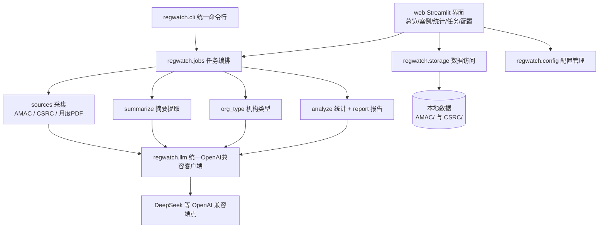

## 产品概述

将现有零散的 AMAC 与证监体系基金案例采集、摘要、分析脚本，整合为一套结构清晰、可持续维护的体系，并提供网页端可视化与操作界面，大幅降低使用门槛；同时统一模型接入方式、补齐版本管理，使流程可回滚、可复用。

## 核心功能

- **统一数据采集**：覆盖中国证券投资基金业协会纪律处分（机构/人员）与中国证监会及 37 家派出机构的行政处罚与监管措施，支持按日期范围、来源局、案例类型、单个链接抓取，支持断点续传与增量更新；保留 AMAC 月度 PDF 公告爬取与机构登记类型回填。
- **统一结构化摘要**：对采集到的案例原文调用大模型提取违规类型、处罚措施、涉及基金、法律依据、罚款金额、市场禁入等字段，并判定案例是否真正基金相关，支持并发处理与失败重试。
- **统一统计与报告**：按违规类型、处罚措施、机构与个人对比、法规引用、时间趋势等维度统计，生成 Markdown/HTML/JSON 报告，并可选用大模型撰写合规建议。
- **网页操作界面**：提供总览看板、案例浏览检索、统计分析图表、任务触发与实时进度日志、模型配置五个页面。案例页可按数据集、主体类型、违规类型、日期、当事机构/人筛选，并展开查看案例详情与原文；统计页以图表呈现分布、对比与趋势；任务页可在网页上发起抓取、摘要、报告任务并实时查看进度与日志；配置页可填写并保存模型接入信息、测试连通性、为不同任务指定不同模型。
- **统一模型配置**：以兼容 OpenAI 的接口格式统一所有模型调用，用户只需在网页端填写接口地址、密钥与模型名称即可保存使用，兼容 DeepSeek 等主流服务及任意 OpenAI 兼容端点，默认面向 DeepSeek。
- **统一命令行入口**：在保留网页操作的同时，提供一致的命令行方式执行采集、摘要、报告与配置管理等全部能力。
- **版本管理与文档**：建立 git 版本管理，仅纳入代码、配置样例与文档，案例数据与 PDF 不入库；补齐依赖清单、使用说明与仓库维护指南。

## 视觉与交互效果

整体呈现为清爽专业的监管数据看板风格：浅色底、深蓝主色与琥珀点缀，数据以卡片、指标块与图表呈现，层级分明；侧边为常驻导航，顶部为全局状态与数据集切换；图表具备悬停提示与平滑过渡，任务日志自动滚动刷新，表单校验与连通性测试结果即时反馈。

## 技术栈

- 语言与运行时：Python 3.12（本机已具备）
- 应用界面：Streamlit（纯 Python 一体化界面，用户已确认），图表用 Plotly
- 模型调用：openai SDK 统一 OpenAI 兼容协议（DeepSeek、任意兼容端点）
- 命令行：Typer + Rich
- 数据访问：原生 json（保持现有磁盘布局），统计用 pandas
- 抓取与解析：requests / BeautifulSoup / aiohttp（沿用现有能力），PDF 与 Word 解析沿用 pypdf、olefile、python-docx
- 测试：unittest / pytest 风格纯本地测试（不发网络请求）

## 实现思路

采取「包化重构 + 统一抽象 + 双入口」策略：新建 `regwatch/` 主包，把配置、模型客户端、数据访问、采集、摘要、统计、报告、任务编排各自独立成模块，原 `AMAC/`、`CSRC/` 下的脚本改为调用包的薄封装入口（保留原有运行方式，作为过渡与回滚保障）。关键决策与理由：

1. **统一 OpenAI 兼容单一实现**：现有代码按 provider 分支（智谱私有 SDK + thinking、MiMo 的 max_completion_tokens 与 top_p、其余标准参数），分支复杂且硬编码密钥。新方案统一为「配置驱动」：模型条目包含 name、base_url、api_key、model、vision_model、extra 参数与任务用途标签；客户端统一走 `chat.completions.create`，差异化参数通过条目级 extra 透传。若目标模型不支持某个附加参数，捕获异常并自动降级重试一次，从而在不牺牲兼容性的前提下彻底消除分支。
2. **数据零迁移**：现有 1.6GB 案例数据保留在 `AMAC/cases`、`AMAC/summaries`、`CSRC/cases`、`CSRC/summaries` 原位，由 `storage` 层按「数据集 + 布局」解析路径，默认沿用现有布局并允许在配置中覆盖根目录。避免大规模数据搬迁带来的风险。
3. **任务与界面解耦**：Streamlit 每次交互会重跑脚本，长任务不能阻塞主线程。`jobs` 模块用后台线程执行，任务状态、进度与日志写入线程安全的内存缓冲并落盘到日志文件，界面通过轮询读取，避免界面卡死与重复执行。
4. **性能与 token 控制**：列表与看板只读结构化字段并缓存（st.cache_data），案例原文按需加载（点击详情时再读 raw_text），避免一次性加载全部正文；摘要读取优先走 `_summary_index.json` 索引，减少目录遍历。抓取侧沿用现有 ThreadPoolExecutor 并发与节流策略。
5. **安全**：彻底移除源码中的硬编码 API Key，配置写入 `config.json`（已加入 .gitignore），并支持环境变量覆盖；连通性测试仅做最小请求，不回显密钥。

## 实现注意事项

- 采集与摘要务必保持既有字段语义与磁盘命名不变（CSRC 为 `{Bureau}/{measure|penalty}/{case_id}.json`，AMAC 为扁平 `{case_id}_summary.json`），否则会破坏已有索引与分析脚本。
- AMAC 数据存在 `date`/`title` 与 `raw_text` 不一致的情况，涉及时间与分析时以正文落款为准，此约定写入文档。
- Streamlit 缓存需以配置版本与数据更新时间作为缓存键，数据更新后主动失效，防止展示陈旧结果。
- 后台任务禁止并发启动同类型任务，需加锁与状态机（pending/running/success/failed/cancelled）。
- 报告渲染逻辑与 prompt 保持现有分类体系与章节结构（概况、违规类型、处罚分析、机构个人对比、法规依据、典型案例、合规建议、附件清单），保证历史报告可比。

## 系统架构



## 目录结构

本次为包化重构，新增主包与网页应用，原脚本改为薄封装，数据目录保持不动。

```
e:/Desktop/codes/
├── regwatch/                        # [NEW] 主包
│   ├── __init__.py                  # 包初始化与版本导出，暴露顶层 API
│   ├── config.py                    # 配置管理：读写 config.json，路径/模型/并发设置，环境变量覆盖，缺失时从 example 兜底
│   ├── llm.py                       # 统一 OpenAI 兼容客户端：文本与视觉调用、模型路由、连通性测试、参数降级重试
│   ├── datamodels.py                # 数据模型：CaseData、CaseSummary、TaskState、ModelProfile，字段与现有磁盘字段对齐
│   ├── storage.py                   # 数据访问层：按数据集解析路径，读写案例/摘要/索引，兼容现有 AMAC 扁平与 CSRC 分目录布局
│   ├── prompts.py                   # AMAC 与 CSRC 的抽取提示词及合规建议提示词，保留既有违规类型分类体系
│   ├── summarize.py                 # 统一结构化摘要提取：串行与并发、断点续传、非基金相关跳过
│   ├── org_type.py                  # 机构登记类型查询与回填：缓存、活跃与已注销接口、正文正则、人工清单
│   ├── analyze.py                   # 统计计算：违规分布、处罚分布、机构个人对比、法规引用、时间趋势
│   ├── report.py                    # 报告渲染：Markdown/HTML/JSON 输出，可选 LLM 合规建议
│   ├── jobs.py                      # 任务编排：后台线程、任务注册表、进度与日志缓冲、取消与去重
│   ├── cli.py                       # Typer 统一 CLI：fetch/summarize/report/org-type/config/web 子命令
│   └── sources/                     # 采集子包
│       ├── __init__.py
│       ├── amac.py                  # AMAC 抓取器：列表翻页、HTML/PDF 正文、机构类型补全（迁移原 AMAC/1-case_fetcher.py）
│       ├── amac_monthly.py          # AMAC 月度公告 PDF 爬虫（迁移原 0-crawl_amac_cases_monthly.py）
│       ├── csrc.py                  # CSRC 抓取器：多局多类型、searchList 接口、HTML/Word/PDF 抽取与基金相关性过滤（迁移原 CSRC/1-case_fetcher.py）
│       └── csrc_bureaus.py          # 37 个证监局配置与查找工具（迁移原 CSRC/bureaus.py）
├── web/                             # [NEW] Streamlit 网页应用
│   ├── app.py                       # 应用入口：页面路由、全局状态栏与侧边导航
│   ├── pages/
│   │   ├── overview.py              # 总览看板：指标卡、数据集概览、最近案例、迷你趋势
│   │   ├── cases.py                 # 案例浏览：多维筛选、结果表格、详情与原文展开
│   │   ├── statistics.py            # 统计分析：分布、对比、法规 TOP、时间趋势图表
│   │   ├── jobs.py                  # 任务中心：任务表单、启动、进度条与实时日志
│   │   └── settings.py              # 模型配置：条目增删改、连通性测试、按任务映射模型
│   ├── components/
│   │   └── charts.py                # 复用图表与卡片组件，统一配色与交互
│   └── .streamlit/
│       └── config.toml              # [NEW] 主题、字体与布局配置
├── tests/                           # [NEW] 纯本地测试
│   ├── test_config.py               # 配置读写与默认值、环境变量覆盖
│   ├── test_llm.py                  # 模型配置解析与路由（不发网络请求，mock 客户端）
│   ├── test_storage.py              # 数据访问层路径解析与索引读写
│   ├── test_bureaus.py              # 37 局配置与工具函数（迁移并修正原 test_smoke.py）
│   └── test_stats.py                # 统计计算正确性（含多值违规类型拆分）
├── config.example.json              # [NEW] 配置样例，入库供参考
├── config.json                      # [NEW] 本地实际配置，入 gitignore
├── requirements.txt                 # [NEW] 依赖清单（含 streamlit、plotly 等）
├── README.md                        # [NEW] 安装、启动、使用与目录说明
├── run_web.py                       # [NEW] 网页端一键启动脚本
├── .gitignore                       # [MODIFY] 补充数据、配置、日志、缓存排除规则
├── AGENTS.md                        # [MODIFY] 更新为重构后的结构与访问指引
├── AMAC/
│   ├── 1-case_fetcher.py            # [MODIFY] 改为薄封装，转发到 regwatch.sources.amac 与 regwatch.cli
│   ├── 1.2-backfill_org_type.py     # [MODIFY] 改为薄封装，转发到 regwatch.org_type
│   ├── 2-case_summarizer.py         # [MODIFY] 改为薄封装，转发到 regwatch.summarize
│   ├── 3-report_generator.py        # [MODIFY] 改为薄封装，转发到 regwatch.analyze 与 regwatch.report
│   └── cases/  summaries/  reports/ # 数据与产物，保持原位，不入库
├── CSRC/
│   ├── 1-case_fetcher.py            # [MODIFY] 改为薄封装，转发到 regwatch.sources.csrc
│   ├── 2-case_summarizer.py         # [MODIFY] 改为薄封装，转发到 regwatch.summarize
│   ├── bureaus.py                    # [MODIFY] 改为从 regwatch.sources.csrc_bureaus 再导出，保持兼容
│   ├── test_smoke.py                # [MODIFY] 迁移到 tests/，修正过时断言
│   └── test_live.py                 # [MODIFY] 保留为实网测试，改为调用新包
└── 0-crawl_amac_cases_monthly.py    # [MODIFY] 改为薄封装，转发到 regwatch.sources.amac_monthly
```

## 关键结构

配置样例（`config.example.json`，任务与模型解耦，支持一条配置被多个任务复用）：

```
{
  "data_roots": {
    "amac_cases": "AMAC/cases",
    "amac_summaries": "AMAC/summaries",
    "csrc_cases": "CSRC/cases",
    "csrc_summaries": "CSRC/summaries"
  },
  "concurrency": { "fetch": 8, "summarize": 5 },
  "models": [
    {
      "id": "deepseek-chat",
      "label": "DeepSeek 通用",
      "base_url": "https://api.deepseek.com",
      "api_key": "",
      "model": "deepseek-chat",
      "vision_model": ""
    }
  ],
  "tasks": {
    "summarize": "deepseek-chat",
    "report": "deepseek-chat",
    "vision": "deepseek-chat"
  }
}
```

统一模型客户端对外接口（`regwatch/llm.py`，仅示意签名）：

```python
class LLMClient:
    def __init__(self, profile: ModelProfile) -> None: ...
    def chat(self, messages, model=None, max_tokens=8000, temperature=0.1, extra=None): ...
    def vision(self, pdf_or_image_url: str, prompt: str, max_tokens=4000): ...
    def test_connection(self) -> tuple[bool, str]: ...
```

## Agent 扩展

### SubAgent

- **code-explorer**
- 用途：在迁移 AMAC/CSRC 各脚本到 regwatch 包时，系统性梳理跨文件依赖、调用点与数据流，确保迁移完整、无遗漏。
- 预期成果：输出一份完整的模块依赖与调用点清单，作为迁移任务 4 的执行依据，避免遗漏隐式耦合（如 importlib 动态加载）。

### Skill

- **lsp-code-analysis**
- 用途：重构完成后定位符号定义与引用，排查迁移遗留的悬空引用、重复定义与未使用导入。
- 预期成果：给出悬空引用与重复符号清单并在任务 8 中清零，保证包内引用一致、可安全删除旧实现。